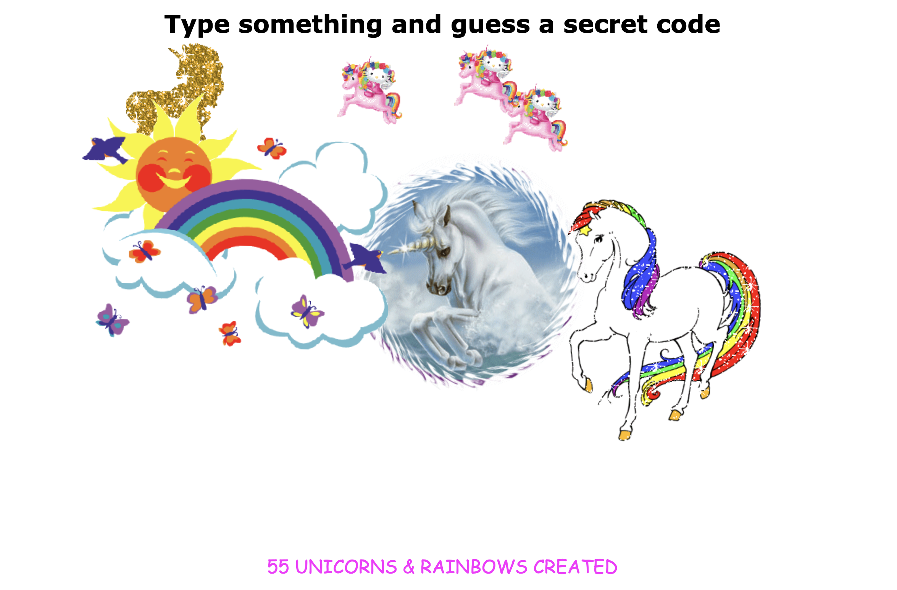

# 12. Key Sequence Detection

#### _Key Sequence Detection by JavaScript30 10/15/19_

## Description
This is Key Sequence Detection, 12th application out of 30 by 30 day Vanilla JavaScript Coding Challenge by Wes Bos.<br>
Please check the challenge from [JavaScript30](http://wesbos.com/javascript30/).




## About this Application:
1. Guess a secret code of this page.
2. Type any words that you can think of on the browser.
3. If the word you typed matches with the secret code, you'll get a unicorn.

- Used [Cornify](cornify.com) for the unicorn creation🦄🌈

## Setup/Installation Requirements

1. Clone this repo:
```
$ git clone https://github.com/misakimichy/JS30-12-key-sequence-detection.git
```

2. Navigate to the top level of the cloned directory.

3. Open `index.html` with your preferred web browser.

## Known Bugs
* No known bugs at this time.

## Support and contact details
 I welcome any feedbacks and comments: misaki.koonce@gmail.com

## Technologies Used
_Git, GitHub, HTML, CSS, Vanilla JavaScript

## License
Copyright © 2019 under the MIT License